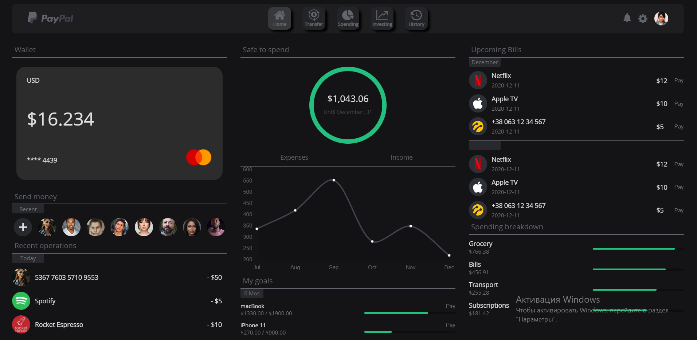

# Online banking


## Table of contents 
---

- [Introduction](#introduction)
- [Build Process](#build-process)
- [Link to website](#link-to-website)

## Introduction
---
This project is an alternative look at what PayPal might look like. Built with React JS project consists of five pages (Home, Transferm, Spending, Investing, History).

 

## Build process
---
- Clone or download repo.
- Create new terminal and write ```npm install``` to install node modules.
- In the terminal write `npm run dev` to run the database. In case of this respond, you have successfully connected to the server.
```
    Successfully connected to MongoDB
    Server has been started and is running on port 3001
``` 
- After the node modules instalation write ```npm start``` to launch the project.

## Link to website
---
Here is a working live website: 